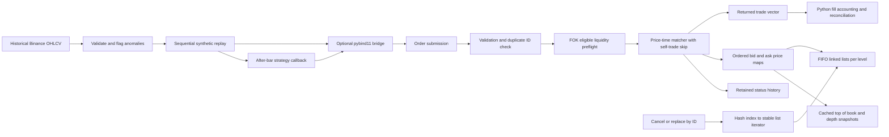

# MatchEngine

A standalone C++17 limit order book with price-time matching, self-trade prevention,
indexed cancellation/replacement, retained order statuses, and measured benchmarks.

**Phases 1 and 2 are implemented and verified.** The supplied build plan asks for
one phase per session. The optional Python package now adds historical replay,
two strategies, and execution-based accounting. Backtesting/statistical reports
(Phase 3) are future work. The standalone C++ build has no Python dependency.

The new **Mini Exchange Simulator** roadmap starts with an independent ITCH 5.0
parser, now included in the CMake build. See the [ITCH module documentation](docs/itch/README.md)
for protocol layouts, build/run instructions, real-data sources and verification.
The new roadmap's gateway, risk and full-integration phases are separate future work.

**Mini Exchange Phase 1 is verified:** the standalone parser processed Nasdaq's
complete December 30, 2019 session—**268,744,780 messages, zero parse failures**—and
reconciled **10,000 sampled order roots** across **16,498 lifecycle updates** to zero
remaining shares. The ITCH tests passed **14 cases / 509 assertions**, including
ASan/UBSan. [Full results and source-integrity limitations](docs/itch/README.md#complete-december-30-2019-session-result)
and [raw statistics](runs/itch/session-statistics.txt) are saved in the repository.

## Build and test

Requires CMake 3.20+ and a C++17 compiler. Catch2 2.13.10 is vendored, so normal
builds need no network access. The engine itself uses only the C++ standard library.

```sh
cmake -S . -B build -DCMAKE_BUILD_TYPE=Release
cmake --build build --config Release --parallel 4
ctest --test-dir build -C Release --output-on-failure
```

On this Windows workspace, the portable LLVM-MinGW and CMake tools are already in
the ignored `.tools/` directory. This helper selects them, builds and tests:

```powershell
.\scripts\build.ps1 -Configuration Release -Benchmark
```

For a fresh Windows checkout, install a C++ toolchain (Visual Studio C++ Build
Tools, or [LLVM-MinGW](https://github.com/mstorsjo/llvm-mingw/releases)) and
[CMake](https://cmake.org/download/), then use the generic commands above.
With LLVM-MinGW, put its `bin` directory on PATH both when building and running
executables, and configure with `-G "MinGW Makefiles" -DCMAKE_CXX_COMPILER=clang++`.
The local helper also uses that generator when portable tools are present.

For GCC/Clang sanitizer verification:

```sh
cmake -S . -B build-sanitized -DCMAKE_BUILD_TYPE=Debug -DMATCHENGINE_SANITIZERS=ON
cmake --build build-sanitized --parallel 4
ctest --test-dir build-sanitized --output-on-failure
```

Set `MATCHENGINE_BUILD_TESTS=OFF` and/or `MATCHENGINE_BUILD_BENCHMARK=OFF` to
disable those targets. Link applications to `MatchEngine::matchengine`.
GitHub Actions is configured for Linux, Windows and macOS, plus Linux sanitizers;
those remote jobs have not been run from this workspace.

## Architecture



The bid map sorts descending; the ask map sorts ascending. Each level uses
`std::list<Order>`, a doubly linked FIFO with stable iterators and constant-time
node removal. This supplies the linked-list behavior requested by the plan
without a custom intrusive allocator. The hash index stores side, price and list
iterator, so cancellation never scans a level or the book. Empty levels are erased.
Each level caches its aggregate remaining quantity; top-of-book prices and
quantities are refreshed after successful mutations and returned by value.

For `L` price levels and `K` examined orders:

| Operation | Cost |
|---|---|
| Add a non-crossing limit | Expected O(log L) |
| Match | O(K), plus empty-level removal and hash updates |
| FOK preflight | O(K), followed by matching only if fully fillable |
| Cancel | Expected O(log L), O(1) list removal |
| Modify | Cancel + add/match |
| Status / cached top | Expected O(1) / O(1) |
| Snapshot of depth D | O(min(D, bid levels) + min(D, ask levels)) |

Hash-table operations have the usual worst-case collision/rehashing costs.
Self-trade skips count toward K, so repeatedly skipping a large book of one's
own orders can be expensive. This is a single-threaded engine, with no locking.
Copy and move are disabled to prevent accidental invalidation of indexed iterators.

## API and behavior

The public header is [`include/matchengine/engine.hpp`](include/matchengine/engine.hpp).
Order and Trade are plain value structs. Order IDs and trader IDs are 64-bit
integers; timestamps are nanoseconds since the Unix epoch. Orders with timestamp
zero receive an engine timestamp. **Actual arrival order establishes FIFO**, even
if caller timestamps arrive out of order. Trades receive execution timestamps.

```cpp
#include <matchengine/engine.hpp>
using namespace matchengine;

Engine engine;
Order ask;
ask.order_id = 1;
ask.trader_id = 101;
ask.side = Side::SELL;
ask.price = 100.0;
ask.quantity = 10;
engine.add_order(ask);

Order buy;
buy.order_id = 2;
buy.trader_id = 102;
buy.side = Side::BUY;
buy.type = OrderType::MARKET;
buy.quantity = 4;
auto trades = engine.add_order(buy); // one trade: 4 units at resting price 100
auto top = engine.get_top_of_book(); // best_ask=100, ask_qty=6
engine.cancel_order(1);
```

| Order type | Execution and remainder |
|---|---|
| LIMIT | Match within price; rest any remainder |
| MARKET | Sweep eligible opposite orders at any price; cancel remainder |
| IOC | Match within price; cancel remainder |
| FOK | Check full eligible quantity within price first; reject if insufficient |

- Execution always uses the **resting order's price**. Every match emits its own
  Trade with a sequential trade ID, quantity, IDs, side and timestamp.
- Self-trade prevention skips the trader's own resting orders, preserving their
  position, and proceeds to eligible orders at the same or worse allowed prices.
  As a consequence, own opposing limit orders can leave a crossed book. They are
  not silently cancelled. Trader ID zero is a valid shared trader identity.
- Fully executed orders are `FILLED`; resting partials are `PARTIALLY_FILLED`.
  Partially filled market/IOC orders finish `CANCELLED` because their remainder
  was cancelled; their executed trades remain valid. An empty-book market order
  is also `CANCELLED` and never rests.
- A rejected FOK records `REJECTED` for its submitted ID, but does not alter any
  resting order, quantity or trade counter. There are no execution/book side effects.
- `modify_order(id, price, qty)` interprets `qty` as the **new remaining quantity**,
  not the lifetime total. It retains the ID/trader, resets the timestamp, and
  always performs cancel + re-add, losing FIFO even when the price is unchanged.
  A crossing replacement executes immediately. Invalid replacement values throw
  `std::invalid_argument` and leave the original order untouched; non-resting IDs
  throw `std::out_of_range`.
- `cancel_order` returns false for unknown or non-resting IDs. Status lookup for
  an unknown ID throws `std::out_of_range`. Final statuses remain queryable.
- IDs must be nonzero and cannot be reused, including rejected/completed IDs.
  Duplicate submissions throw `std::invalid_argument` without altering the
  existing status. Invalid fresh orders return no trades and record `REJECTED`.
- Quantities must be 1 through 4,294,967,295; aggregate quantities are 64-bit.
  Limit/IOC/FOK prices must be finite and positive. Market prices are ignored but
  must be finite. Incoming `remaining_quantity` and `status` are normalized.
- Empty best prices are `std::nullopt`, with quantity zero. Snapshots contain
  price, remaining quantity and order count, in best-price order. Depth zero is empty.

Prices intentionally use `double` as specified. Callers should normalize to a
consistent tick size; this library does not enforce one. Production exchange
systems generally need integer ticks, durability, bounded history, risk limits
and an allocation-failure recovery policy. This implementation retains one status
entry for **every submitted ID**, so memory grows with total order history as well
as live depth. It does not promise transactional recovery from allocation failure.

## Correctness verification

The real Release run passed **13 Catch2 test cases / 34,071 assertions**:

- Empty book, exact fills in both directions, and three-level partial sweeps.
- FIFO despite reversed timestamps; self-trade skips within and across levels.
- Interior-node cancellation, removal after partial execution, and cached top updates.
- Replacement FIFO (changed and unchanged price), crossing replacement, and validation.
- Market/IOC remainders, IOC price protection, and atomic FOK eligibility checks.
- Snapshot depth/aggregates, invalid prices and quantities, duplicate/unknown IDs.
- A fixed-seed 5,000-order mixed stream compared trade-by-trade against an
  independent flat-vector matcher, including periodic cancellations and per-event
  status, order count, aggregate quantity and top-price checks.

Raw test output is in [`benchmarks/results/tests-release.txt`](benchmarks/results/tests-release.txt).
The same suite also passed in a local Debug build with AddressSanitizer and
UndefinedBehaviorSanitizer enabled (CTest: 1.36 seconds, no sanitizer errors).

## Actual benchmark results

Measured locally on **2026-09-13**, AMD Ryzen 7 4800H (16 logical processors),
Windows build 26200, LLVM-MinGW 20260908 / Clang 23.1.1, libc++, CMake 3.31.8,
Release (`-O3 -DNDEBUG`), one engine thread. The recorded run was made after
the Release build/tests finished, without a concurrent compilation job.

| Orders | Throughput | p50 | p95 | p99 | Generated trades | Ending resting orders |
|---:|---:|---:|---:|---:|---:|---:|
| 1,000,000 | 1,767,853 orders/s | 0.300 µs | 0.900 µs | 1.500 µs | 818,440 | 100,717 |

The workload uses seed 42, equal buy/sell probability, 1,000 trader IDs, normally
distributed prices around 100 (standard deviation 0.50, 0.01 ticks), lognormal
quantities, and 80% limit / 10% market / 5% IOC / 5% FOK orders. Inputs are
generated before timing; a separate 10,000-order warmup precedes the measured
book. Each `add_order` is individually timed using `steady_clock`; percentiles
use nearest ranks. Throughput includes timer calls, latency storage and trade
vector destruction, but excludes generation, warmup and percentile sorting.
Normal-distribution output may vary between standard-library implementations.

Memory is measured in a **fresh process per depth**, with 200 total price levels,
half bids and half asks, no executions, and no input/latency arrays. OS allocation
granularity and runtime initialization affect small-depth deltas. These are
process-memory deltas, not exact container allocation counts. They include the
order index and retained statuses.

| Resting orders | Resident working-set increase | Private committed increase |
|---:|---:|---:|
| 1,000 | 319,488 bytes | 278,528 bytes |
| 10,000 | 2,760,704 bytes | 2,777,088 bytes |
| 100,000 | 23,166,976 bytes | 24,027,136 bytes |

Raw output: [`benchmarks/results/windows-release.txt`](benchmarks/results/windows-release.txt).
These are measurements of one synthetic workload on this laptop, not a latency
guarantee. Background work, allocator behavior, book shape, hash rehashes and
especially long self-trade skip chains can change the results considerably.

To reproduce on a single-configuration build:

```sh
./build/matchengine_benchmark --orders 1000000
./build/matchengine_benchmark --memory 1000
./build/matchengine_benchmark --memory 10000
./build/matchengine_benchmark --memory 100000
```

For Visual Studio builds use `build/Release/matchengine_benchmark.exe`. Memory
measurement supports Windows (working set/private commit) and Linux (resident
memory; private bytes are reported as zero/unavailable). Timing supports all
platforms supported by the C++ build.

## Phase 2: Python bridge and historical replay

The native extension exposes the existing `Engine` methods and all Order/Trade
fields with owned value objects. Optional prices become `None`, trade vectors
become lists, and snapshots expose their levels as lists. The engine source and
header are unchanged. `MATCHENGINE_BUILD_PYTHON` defaults to `OFF`; enabling it
adds a module target and position-independent compilation for the library.

### Install and run

Python 3.10+ with development headers and the Phase 1 build tools are required.
On this Windows workspace, use the supplied helper:

```powershell
.\scripts\build-python.ps1 -InstallDependencies
.\.venv\Scripts\python.exe run_replay.py --strategy ma_crossover --symbol BTCUSDT --start 2023-01-01 --end 2024-01-01 --data data/raw/BTCUSDT-2023-1d.json --output runs/phase2/ma_crossover
.\.venv\Scripts\python.exe run_replay.py --strategy mean_reversion --symbol BTCUSDT --start 2023-01-01 --end 2024-01-01 --data data/raw/BTCUSDT-2023-1d.json --output runs/phase2/mean_reversion
```

The helper installs the wheel into `.venv` and runs pytest. With dependencies
already installed, omit `-InstallDependencies` for an offline rebuild. This
workspace's sandbox strips the compiler PATH from Python subprocesses, so the
local wheel build was run outside that sandbox. Ordinary terminal builds do not
need a special permission step.

On other machines, with CMake and a C++ compiler available:

```sh
python -m venv .venv
# Activate .venv using your platform's activation command, then:
python -m pip install ".[test]"
python -m pytest
matchengine-replay --strategy ma_crossover --symbol BTCUSDT --start 2023-01-01 --end 2024-01-01
```

**First Python installation needs network access** for pinned pybind11 3.0.1,
scikit-build-core 0.11.6, and optional pytest 8.4.2 (plus their dependencies).
`requirements-dev.txt` installs these ahead of time; `pip install .
--no-build-isolation --no-deps` then builds offline. Python runtime code otherwise
uses the standard library. LLVM-MinGW runtime DLLs are packaged beside the Windows
extension, so importing the installed wheel does not require a toolchain on PATH.
The wheel is specific to its Python version/platform. After source edits, rebuild
and reinstall it; this is a regular wheel installation, not an editable install.

Omit `--data` to fetch candles from Binance's public market-data endpoint and cache
them with source URLs, retrieval time and SHA256 metadata. With `--data`, replay
is offline. The checked-in [2023 candles](data/raw/BTCUSDT-2023-1d.json) and
[provenance](data/raw/BTCUSDT-2023-1d.metadata.json) are a real download, not a
fabricated fixture. When metadata is present, the CLI checks its symbol and hash.
`BTCUSDT` is BTC quoted in USDT; it is deliberately not relabeled `BTC-USD`.
Provider reference: [Binance kline market-data API](https://developers.binance.com/docs/binance-spot-api-docs/rest-api/market-data-endpoints).

### Replay model and causality

The replay is an explicit OHLCV-derived liquidity model, not reconstructed tick
history. All engine quantities are integer **lots**; by default one lot represents
0.001 BTC. Prices and cash are in USDT. Defaults are 10,000 starting cash, 100-lot
strategy targets (0.1 BTC), 5 bps fee per portfolio fill, and a 2 bps quoted spread.

1. Validate daily UTC bars before replay. Invalid OHLCV/interval rows are logged
   and skipped. Duplicate timestamps retain the first valid row with a warning.
   Out-of-order input is flagged and sorted. Missing bars and >20% opening gaps
   or intrabar close/open returns are flagged without imputation or silent removal.
   Known-event timestamps can exempt outlier flags through the validation API.
   Requested leading/trailing coverage is checked. Overlapping bars are flagged
   and refused by replay. The strategy receives none of the full-series diagnostics.
2. For each bar, use open→low→high→close when close >= open, otherwise
   open→high→low→close. Place these four pivots at 0, 1/3, 2/3 and the final
   nanosecond of the bar. This path is a documented convention, not a claim about
   the historical ordering of that candle's extrema.
3. At each pivot, cancel the prior synthetic quotes and add a bid and ask around
   the pivot. Half-spread is `max(tick_size, pivot * spread_bps / 20000)`; round
   bids down and asks up to the 0.01 default tick. Define pulse quantity as
   `min(UINT32_MAX // 2, floor(volume * 0.0001 / (4 * unit_size)))`. Each quote has
   twice that quantity. A separate tape trader submits a market order for one
   pulse, buying if the pivot rose or stayed flat and selling if it fell. Prints
   are therefore near the OHLC pivots, at the actual bid/ask execution price.
   A zero pulse creates neither quotes nor prints.
4. Only **after the bar ends**, invoke `on_bar(bar, context)`. The context contains
   an immutable history prefix, current portfolio position/cash, and a market-order
   submission function. Every order uses the broker's one monotonically increasing
   ID allocator. Strategies receive no future bars or engine handle. Historical
   submission times are nondecreasing; rejected/cancelled IDs are never recycled.
5. Orders execute against the remaining closing quotes. This assumes immediate
   access to modeled close-adjacent liquidity after observing the completed bar;
   it does not model next-open latency, impact, or historical queue depth. Both
   strategies are long/flat, use market orders, and maintain no own resting quotes.
   There is no portfolio risk-limit/margin engine. Open inventory is marked at
   the final historical close rather than forcibly liquidated.

MA crossover defaults to 10/30 bars, buying on a golden cross and selling on a
death cross; it waits for an observed cross rather than assuming an initial one.
Mean reversion defaults to a 20-bar population-standard-deviation z-score, entering
below -1.5 and exiting at z >= 0. `on_fill` alone changes each strategy's position,
so unfilled/partially filled requests cannot create imagined inventory.

### Execution records and timestamps

`Broker.submit` calls the real native engine and records every returned Trade,
including synthetic tape prints. Portfolio cash changes by signed actual
`quantity * unit_size * price`, plus fee per fill. Slippage is actual execution
price minus the pre-submission bid/ask midpoint; adverse slippage reverses the
sign for sells. A missing or crossed top has no valid midpoint and records `None`.
Self-trade skips are never treated as executions.

The actual header uses **uint64** timestamps and quantity storage. Python preserves
that representation: negative or >uint64 fields raise `TypeError`; fresh quantities
outside 1..UINT32_MAX are rejected by the engine as in C++. Unknown status/modify
IDs map to Python `IndexError`; duplicate IDs and invalid replacements map to
`ValueError`. Invalid fresh orders record `REJECTED` instead of throwing.

Crucially, the unchanged C++ engine timestamps **Trade at execution wall time**,
even when Order carries historical nanoseconds. Logs preserve that field as
`timestamp` and separately record `simulation_timestamp`. The console labels its
historical-time column explicitly. Repeated runs reproduce prices, quantities,
IDs and simulated times; native execution timestamps differ. Phase 3 must account
for these two clocks rather than silently plotting wall-time trades on a historical
price axis or rewriting the native timestamps.

The broker keeps a live-order mirror solely to count self-order visits during
matching; fills always come from C++. These diagnostic counts exclude visits in a
rejected FOK preflight. The core API exposes no native skip counter, so this is a
broker-derived count, valid while all mutations go through it. Each bar independently
reconciles net executed trader quantities, portfolio position and strategy position.

### Verified Phase 2 runs

Both strategies ran over the same 365 real BTCUSDT daily bars, 2023-01-01 inclusive
through 2024-01-01 exclusive, with the defaults above. Validation produced zero
warnings/skipped rows. Both runs recorded zero self-trade skips and FOK rejections.

| Strategy | Actual strategy fills | Fees (USDT) | Ending position (BTC) | Ending equity (USDT) | Marked PnL (USDT) |
|---|---:|---:|---:|---:|---:|
| MA crossover (10/30) | 11 | 14.9955 | 0.1 | 11,311.5815 | 1,311.5815 |
| Mean reversion (20, z=1.5) | 18 | 23.8758 | 0 | 10,971.2502 | 971.2502 |

MA PnL includes unrealized value on its ending position. These are Phase 2 model
outputs; no parameter optimization, walk-forward validation or significance claim
has been made.

Saved runs: [MA summary](runs/phase2/ma_crossover/summary.json) /
[fills](runs/phase2/ma_crossover/trades.jsonl), and
[mean-reversion summary](runs/phase2/mean_reversion/summary.json) /
[fills](runs/phase2/mean_reversion/trades.jsonl). Each directory also contains
`events.jsonl` (all actual native trades with trader attribution) and `equity.jsonl`
(bar-end cash, position and marked equity). Summaries include the exact config,
data hash, validation issues and execution diagnostics needed for reproduction.

**Verification:** 38 pytest tests passed against the installed CPython 3.13.2
extension, including all requested binding contracts, prefix-only callbacks,
future-data perturbation, passive/partial/zero-fill accounting, reconciliation,
downloader pagination/provenance and the offline CLI. The original C++ Catch2
suite still passes. Python build/test jobs are configured in the cross-platform
CI matrix; those remote jobs have not been executed from this workspace.
