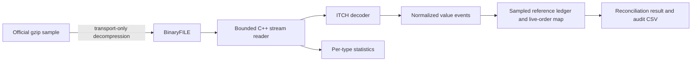

# ITCH 5.0 parser — Mini Exchange Simulator, Phase 1

This independent C++17 library decodes binary exchange messages into normalized
value events. It does not link against or modify the existing matching engine.
The concurrent gateway, risk layer and end-to-end simulator are later phases.



## Specification and representation

Layouts were checked against the official [TotalView-ITCH 5.0 specification](https://www.nasdaqtrader.com/content/technicalsupport/specifications/dataproducts/NQTVITCHspecification.pdf)
and [BinaryFILE framing specification](https://www.nasdaqtrader.com/content/technicalsupport/specifications/dataproducts/binaryfile.pdf).

Offsets below start at the message-type byte, excluding the two-byte file prefix.
Integers are unsigned big-endian; explicit shifts/OR avoid host byte-order and
alignment assumptions. Every field read checks bounds against the declared payload.
The common header is type (0:1), stock locate (1:2), tracking number (3:2), timestamp
(5:6), where notation is offset:width in bytes. Timestamps retain all 48 bits and
mean **nanoseconds since midnight in the feed session**, not Unix epoch time.
File order is preserved, even if timestamps regress; regressions are reported.

Order/trade prices are four-byte `Price(4)` integers with four implied decimals.
The normalized price retains exact 0.0001 currency units: 1,234,567 means 123.4567.
`decimal_price` is an explicit display conversion. The administrative V message's
different `Price(8)` representation is not interpreted as an order price.

## Supported messages

| Tag | Payload bytes | Normalized event | Fields after common header (offset:width) |
|---|---:|---|---|
| S | 12 | SystemEvent | Event code 11:1 |
| R | 39 | InstrumentDirectory | Symbol 11:8, complete directory fields below |
| A | 36 | OrderAdded | Reference 11:8, side 19:1, shares 20:4, symbol 24:8, price 32:4 |
| F | 40 | OrderAdded | Same as A, plus MPID 36:4 |
| E | 31 | OrderExecuted | Reference 11:8, shares 19:4, match number 23:8 |
| C | 36 | OrderExecuted | Same as E, printable 31:1, execution price 32:4 |
| X | 23 | OrderCancelled | Reference 11:8, cancelled shares 19:4 |
| D | 19 | OrderDeleted | Reference 11:8; remove all remaining shares |
| U | 35 | OrderReplaced | Old reference 11:8, new reference 19:8, new shares 27:4, price 31:4 |
| P | 44 | Trade | Legacy reference 11:8, side 19:1, shares 20:4, symbol 24:8, price 32:4, match number 36:8 |

R fields after symbol: market category 19:1, financial status 20:1, round-lot size
21:4, round-lots-only 25:1, issue classification 26:1, subtype 27:2, authenticity
29:1, short-sale threshold 30:1, IPO flag 31:1, LULD price tier 32:1, ETP flag 33:1,
leverage factor 34:4, inverse indicator 38:1. ASCII strings trim only right padding.
Categorical directory flags are retained instead of mapped through a stale enum list.

System O/S/Q/M/E/C codes become explicit session-state enums. Adds retain optional
MPID attribution. E has no explicit price; downstream consumers use the referenced
resting price. C retains its execution price and printable flag; non-printable
executions still reduce displayed quantity.

P is a non-displayed trade print, **not a book mutation**. Nasdaq specifies that its
legacy reference is zero and its side is always B regardless of actual resting side.
The decoder reads these fields but does not invent a usable order reference or
aggressor direction. Match IDs are retained. U inherits side/instrument from the old
order and admits a new reference with a replacement quantity, not a delta.

### Explicitly outside normalized book semantics

Recognized tags H(25), Y(20), L(26), V(35), W(12), K(28), J(35), h(21), Q(40),
B(19), I(50), N(20) have their common header and exact length checked. They are
counted separately as `Administrative` events; their payload semantics are not
decoded or claimed fully validated. Auction processing, corrected time-and-sales,
imbalance analysis, and live transports such as MoldUDP64 are outside scope.
Unrecognized tags are fatal errors, never silently skipped.

## Streaming and failures

`itch::Reader(std::istream&)` reads each two-byte big-endian length and bounded
payload into a fixed 65,535-byte buffer. It never loads the file wholesale.
`parse_message` also decodes individual unframed payloads. The wire tag stays in
`itch::Message`; downstream code consumes `exchange::Event` without wire offsets.

Wrong lengths, truncated prefixes/payloads, unknown tags, invalid side/printable
flags, non-ASCII strings and out-of-day timestamps throw `ParseError` with a byte
offset. Input I/O failures are fatal. The CLI prints errors and exits nonzero;
there is no catch-and-skip or resynchronization policy.

BinaryFILE defines a zero-length final record. The reader recognizes it and rejects
trailing bytes. It separately identifies clean physical EOF without that record:
Nasdaq's complete NOII sample ends at System C without a zero-length record.
Default CLI validation requires first System O, last System C and clean framing;
`--require-terminator` additionally enforces the literal BinaryFILE terminator.
The report exposes both conditions. Missing session-end events are fatal.

## Sampled order-reference reconciliation

The reconciler audits the first N Add events in file order (default 10,000), across
symbols, and follows every replacement descendant until session end. This is a
deterministic **reference sample**, not an audit of every order in the market.
Unsampled references are outside the check. Closed sampled references remain known
so late updates and duplicate reuse fail rather than disappearing silently.

Each root has a cumulative ledger and a separate current live-order record:

```text
initial added + replacement added
  - executed - cancelled - deleted - replacement removed
  = remaining live shares
```

Deletes remove the full remainder. Replacements retire the old remainder and add
the new quantity/reference, inheriting side/instrument. Both printable and
non-printable executions reduce shares. P prints, Q crosses and B breaks do not
directly mutate displayed orders. Zero/excessive reductions, stale references,
duplicate sampled IDs, replacement collisions and instrument changes are errors.
The checker verifies affected ledgers and finally compares their total remainder
with the live map. Audit CSV exposes every term per sampled root.

## Build and reproduce

Normal CMake builds include `itch_parser`, `itch_stats` and `itch_tests`.
`MATCHENGINE_BUILD_ITCH=OFF` excludes them; Python wheels disable this unrelated
module. Parser builds/tests are offline, using the existing vendored Catch2.

```sh
cmake -S . -B build -DCMAKE_BUILD_TYPE=Release
cmake --build build --config Release --parallel 4
ctest --test-dir build -C Release --output-on-failure
python scripts/download_itch.py --sample session --decompress --allow-unavailable-md5
./build/itch_stats data/itch/12302019.NASDAQ_ITCH50 --sample-orders 10000 --audit runs/itch/order-audit.csv
```

Use `.\scripts\build.ps1` in this Windows workspace to select the portable tools.
For direct CLI runs, add `.tools/llvm-mingw-20260908-ucrt-x86_64/bin` to PATH.
Visual Studio executables are under `build/Release/`. The audit's parent directory
must exist. `itch_stats -` also accepts binary stdin, including on Windows.

The standard-library Python downloader uses bounded parallel HTTP byte ranges,
validates response ranges/counts, checks Nasdaq's full-session MD5 when available, and records
SHA256, sizes, source URL and retrieval time. Gzip decompression streams to disk
and verifies the CRC/trailer before promoting output. Python is only a transport
convenience; C++ reads the uncompressed binary file without Python or zlib.

During this run Nasdaq's listed MD5 URL returned HTTP 404, and its FTP endpoint
was unreachable. The completed archive was retained; retrying with
`--allow-unavailable-md5 --decompress` permits only this documented HTTP-404 case,
requires the full gzip CRC/trailer check, and records `official_md5_verified=false`.
A checksum mismatch still fails. The saved local SHA256/MD5 values identify the
downloaded bytes but are not claimed to have been compared with a publisher digest.

Exact public sources:

- [12302019.NASDAQ_ITCH50.gz](https://emi.nasdaq.com/ITCH/Nasdaq%20ITCH/12302019.NASDAQ_ITCH50.gz): 3,524,013,057 compressed bytes;
  [official MD5](https://emi.nasdaq.com/ITCH/Nasdaq%20ITCH/12302019.NASDAQ_ITCH50.gz.md5sum).
- [S050922-v50-NOII.txt.gz](https://emi.nasdaq.com/ITCH/Nasdaq%20ITCH/NOII/S050922-v50-NOII.txt.gz): 96,588,423 compressed bytes.

Large archives and expanded files remain in gitignored `data/itch/`. Small
statistics, audit and provenance artifacts are retained in `runs/itch/`.

## Verified checks

Hand-written hex fixtures independent of the production offset table cover every
required message and field, non-symmetric endian values, 64-bit IDs, 48-bit times,
four-decimal prices, every truncation point, oversized payloads, framing failures
and reference-lifecycle accounting. Release and ASan/UBSan each passed **14 cases /
509 assertions**. The original engine also passed both builds. CTest required the
host toolchain PATH outside the workspace sandbox; direct executables passed inside.
Existing CI now includes the ITCH tests and sanitizer instrumentation automatically.

The full NOII sample processed **5,954,783 messages** with zero parse failures:
6 S messages and 5,954,777 length-validated I messages, totaling 309,648,488 raw
bytes. Its reconciliation is explicitly `NOT_APPLICABLE_NO_ADDS`.

Evidence: [NOII statistics](../../runs/itch/noii-statistics.txt),
[provenance](../../runs/itch/noii-provenance.json), [unit tests](../../runs/itch/unit-tests.txt),
and [sanitizers](../../runs/itch/sanitizer-tests.txt).

## Complete December 30, 2019 session result

The full **8,251,407,909-byte** file was processed to its System C end event with
**268,744,780 messages and zero parse failures**. Of these, 264,469,451 were decoded
into the ten supported normalized message types; 4,275,329 were explicitly
length-validated administrative messages. No unknown types were skipped.

| Type | Count | Type | Count |
|---|---:|---|---:|
| A | 117,145,568 | C | 99,917 |
| D | 114,360,997 | E | 5,722,824 |
| F | 1,485,888 | H | 8,966 |
| I | 4,024,315 | J | 34 |
| K | 3 | L | 215,161 |
| P | 1,218,602 | Q | 17,836 |
| R | 8,906 | S | 6 |
| U | 21,639,067 | V | 1 |
| X | 2,787,676 | Y | 9,013 |

All **10,000 sampled roots** reconciled after **16,498 checked updates**, with
**zero live sampled orders / zero remaining sampled shares** at the end. Every
exported ledger row also passed an independent Python arithmetic check. This is
sampled-reference evidence, not a claim that all 118+ million adds were reconciled.

The session had no timestamp regressions. Like the NOII sample, it ended after
System C at physical EOF without a BinaryFILE zero-length final record; this is
exposed as `binaryfile_terminator=0`, not hidden.

The local Release pass took **188.831 seconds**, approximately **1.423 million
messages/second**, including file reads, normalized decoding, per-type counting
and the 10,000-root audit. It excludes downloading/decompression. Hardware was
the same Ryzen 7 4800H Windows machine used for the engine benchmark, with
LLVM-MinGW Clang 23.1.1. This is a single measured run, not a latency guarantee.

The complete gzip CRC/trailer verified successfully. Publisher MD5 could not be
verified because the listed endpoint returned HTTP 404. Recorded archive SHA256:
`ef03df46a27e6bda4dead017f84c2e3979df7211f02c7868b51d53fceb99c689`.
Recorded raw-file SHA256:
`5d81c2e14a0f748b29c674b6a342796932702034b4dd341e39e9a9ec5bac610f`.

Evidence: [full statistics](../../runs/itch/session-statistics.txt),
[source/integrity provenance](../../runs/itch/session-provenance.json),
[10,000-row audit](../../runs/itch/order-audit.csv), and
[independent audit totals](../../runs/itch/audit-summary.json).
